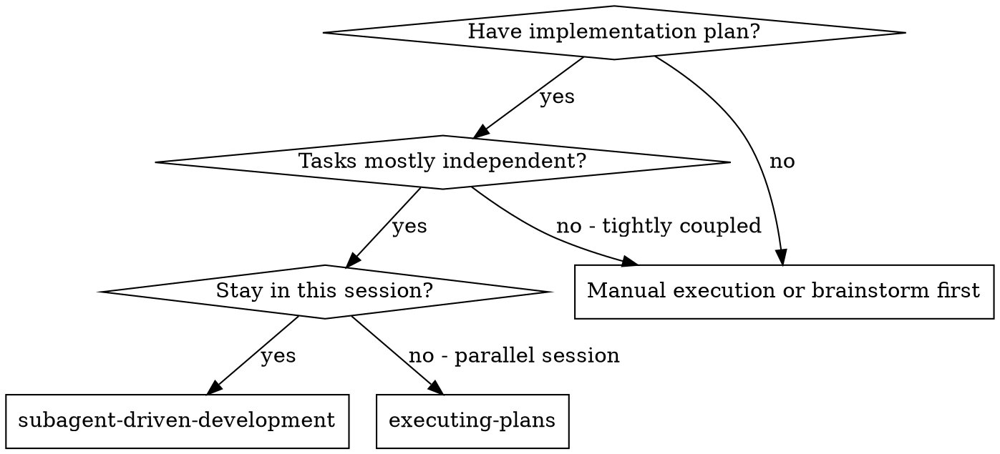
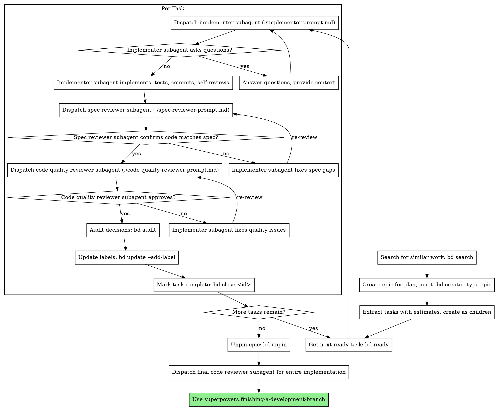

# Subagent-Driven Development

Execute plan by dispatching fresh subagent per task, with two-stage review after each: spec compliance review first, then code quality review.

**Core principle:** Fresh subagent per task + two-stage review (spec then quality) = high quality, fast iteration

## When to Use



**vs. Executing Plans (parallel session):**
- Same session (no context switch)
- Fresh subagent per task (no context pollution)
- Two-stage review after each task: spec compliance first, then code quality
- Faster iteration (no human-in-loop between tasks)

## The Process (Enhanced with BD Features)



## Prompt Templates

- `./implementer-prompt.md` - Dispatch implementer subagent
- `./spec-reviewer-prompt.md` - Dispatch spec compliance reviewer subagent  
- `./code-quality-reviewer-prompt.md` - Dispatch code quality reviewer subagent

## Example Workflow with Advanced BD Features

```
You: I'm using Subagent-Driven Development to execute this plan.

[Read plan file once: docs/plans/feature-plan.md]
[Plan is for: Authentication System with 5 tasks]

STEP 1: Search for similar work
$ bd search "authentication system JWT login"
No similar work found.

STEP 2: Create epic and pin it
$ bd create "Feature: Authentication System" --type epic --estimate 180
Created: superpowers-epic-1a2b3c

$ bd pin superpowers-epic-1a2b3c
Pinned: Feature: Authentication System (visible in all bd commands)

STEP 3: Extract tasks and create with estimates, labels, and dependencies
$ bd create "Task 1: JWT token generation" --type task --priority 2 \
  --parent superpowers-epic-1a2b3c --estimate 30 \
  --labels "implementation,backend,auth,needs-review"
Created: superpowers-a3f8e9

$ bd create "Task 2: Login endpoint" --type task --priority 2 \
  --parent superpowers-epic-1a2b3c --estimate 45 \
  --labels "implementation,api,auth,needs-review" \
  --deps blocks:superpowers-a3f8e9
Created: superpowers-b2c7d1

$ bd create "Task 3: Registration endpoint" --type task --priority 2 \
  --parent superpowers-epic-1a2b3c --estimate 40 \
  --labels "implementation,api,auth,needs-review"
Created: superpowers-c9d2e5

$ bd create "Task 4: Frontend auth forms" --type task --priority 2 \
  --parent superpowers-epic-1a2b3c --estimate 35 \
  --labels "implementation,frontend,auth,needs-review" \
  --deps blocks:superpowers-b2c7d1,blocks:superpowers-c9d2e5
Created: superpowers-d1a8f3

$ bd create "Task 5: Integration tests" --type task --priority 3 \
  --parent superpowers-epic-1a2b3c --estimate 30 \
  --labels "testing,integration,auth" \
  --deps blocks:superpowers-d1a8f3
Created: superpowers-e7b4c2

STEP 4: Check what's ready to work on
$ bd ready
superpowers-a3f8e9 P2 task   open  Task 1: JWT token generation [30m]
superpowers-c9d2e5 P2 task   open  Task 3: Registration endpoint [40m]

STEP 5: Start with first ready task
$ bd update superpowers-a3f8e9 --status in_progress

Task 1: JWT token generation

[Get Task 1 text and context from plan]
[Dispatch implementation subagent with full task text + context + time estimate]

Implementer: "Should we use RS256 or HS256 for signing?"
You: "RS256 with key rotation support"

Implementer: "Got it. Implementing now..."
[Later] Implementer:
  - Implemented JWT generation with RS256
  - Added key rotation support
  - Tests: 8/8 passing
  - Self-review: Found missing expiry validation, fixed
  - Committed

[Dispatch spec compliance reviewer]
Spec reviewer: ✅ All requirements met:
  - RS256 signing ✓
  - Key rotation ✓
  - Expiry handling ✓

[Dispatch code quality reviewer]
Code reviewer: Approved. Good error handling and test coverage.

$ bd audit "Task 1: Implemented RS256 JWT with key rotation. All tests passing."
$ bd update superpowers-a3f8e9 --add-label "spec-compliant" --add-label "reviewed"
$ bd close superpowers-a3f8e9
Closed: superpowers-a3f8e9

STEP 6: Check next ready task
$ bd ready
superpowers-b2c7d1 P2 task   open  Task 2: Login endpoint [45m]
superpowers-c9d2e5 P2 task   open  Task 3: Registration endpoint [40m]

[Continue with next task...]

STEP 7: After all tasks complete
$ bd unpin superpowers-epic-1a2b3c
Unpinned epic

$ bd show superpowers-epic-1a2b3c
Epic: Feature: Authentication System
Status: 5/5 tasks complete
Total estimate: 180 minutes
Labels used: implementation, testing, auth, spec-compliant, reviewed

$ bd close superpowers-epic-1a2b3c
Closed epic: superpowers-epic-1a2b3c

[Dispatch final code reviewer for entire implementation]
[Use finishing-a-development-branch skill]
```

## BD-Specific Enhancements

### Epic-Based Organization
```bash
# ALWAYS create epic for multi-task plans
bd create "Feature: $PLAN_TITLE" --type epic --estimate $TOTAL_MINUTES
bd pin $EPIC_ID  # Keep visible throughout work

# All tasks become children
bd create "Task" --parent $EPIC_ID --estimate 30 --labels "..."

# Track progress by epic
bd show $EPIC_ID  # Shows all child tasks, completion %, time spent
bd graph --epic $EPIC_ID  # Visualize task dependencies
```

### Time Estimation Best Practices
```bash
# Add realistic estimates to EVERY task
# Guidelines:
# - Simple implementation: 15-30 min
# - Complex feature: 45-90 min  
# - With tests: add 50% more time
# - With reviews: add 20% more time

bd create "Simple fix" --estimate 15
bd create "Complex feature with tests" --estimate 90
```

### Semantic Labeling System
```bash
# Standard labels for subagent-driven work:
--labels "implementation,backend,needs-review"    # Implementation tasks
--labels "spec-compliant,reviewed"                # After reviews pass
--labels "blocked,external-dependency"            # When blocked
--labels "bug-fix,production"                     # For bug fixes

# Filter by status
bd list --label needs-review     # What needs review
bd list --label spec-compliant   # What passed spec review
```

### Search Before Creating
```bash
# MANDATORY: Search before creating any tasks
bd search "$KEYWORDS_FROM_PLAN"

# If similar work found:
bd show $SIMILAR_ID  # Review what was done
# Consider reusing approach or learning from issues
```

### Audit Trail for Reviews
```bash
# Record ALL review decisions
bd audit "Spec Review: Missing error handling for network timeout"
bd audit "Code Review: Approved after adding input validation"
bd audit "Decision: Using Redis for session storage due to scale requirements"

# Creates permanent record for future reference
```

### External References
```bash
# Link to external systems when applicable
bd create "Fix auth bug" --external-ref "gh-457" --external-ref "linear-ENG-1234"

# Enables traceability
bd search "gh-457"  # Find our task for GitHub issue
```

### Session Persistence & Recovery
```bash
# If interrupted, easy recovery:
bd list --status in_progress    # What was being worked on
bd list --parent $EPIC_ID       # All tasks in feature
bd show $EPIC_ID                # Overall progress
bd graph --epic $EPIC_ID        # Visual dependency status
```

## Advantages

**vs. TodoWrite:**
- **Persistent**: Tasks survive session restarts
- **Dependencies**: Automatic DAG-based task ordering
- **Rich metadata**: Priority, estimates, assignees, labels
- **Git integration**: Team visibility via bd sync
- **Audit trail**: Full history of changes
- **Epic organization**: Group related tasks, track feature progress
- **Time tracking**: Estimates help planning and retrospectives
- **Search**: Avoid duplicating work

**vs. Manual execution:**
- Subagents follow TDD naturally
- Fresh context per task (no confusion)
- Parallel-safe (subagents don't interfere)
- Subagent can ask questions (before AND during work)

**Efficiency gains:**
- No file reading overhead (controller provides full text)
- Controller curates exactly what context is needed
- Subagent gets complete information upfront
- Questions surfaced before work begins (not after)
- BD's `ready` command automatically finds next unblocked task
- Pinned epic keeps context visible

## Red Flags

**Never:**
- Skip searching before creating tasks
- Create tasks without estimates
- Forget to create epic for multi-task plans
- Skip pinning epic during work
- Create tasks without semantic labels
- Skip audit trail for decisions
- Move to next task without closing current
- Forget to unpin epic when done

**If subagent fails task:**
- Mark task as blocked: `bd update <id> --status blocked`
- Add comment explaining issue: `bd comment <id> "Failed: <reason>"`
- Audit the failure: `bd audit "Task failed: <details and context>"`
- Check if similar failures exist: `bd search "<error keywords>"`
- Dispatch fix subagent with specific instructions
- Don't try to fix manually (context pollution)

## Integration

**Required workflow skills:**
- **superpowers:writing-plans** - Creates the plan this skill executes
- **superpowers:requesting-code-review** - Code review template for reviewer subagents
- **superpowers:finishing-a-development-branch** - Complete development after all tasks

**Subagents should use:**
- **superpowers:test-driven-development** - Subagents follow TDD for each task

**Alternative workflow:**
- **superpowers:executing-plans** - Use for parallel session instead of same-session execution