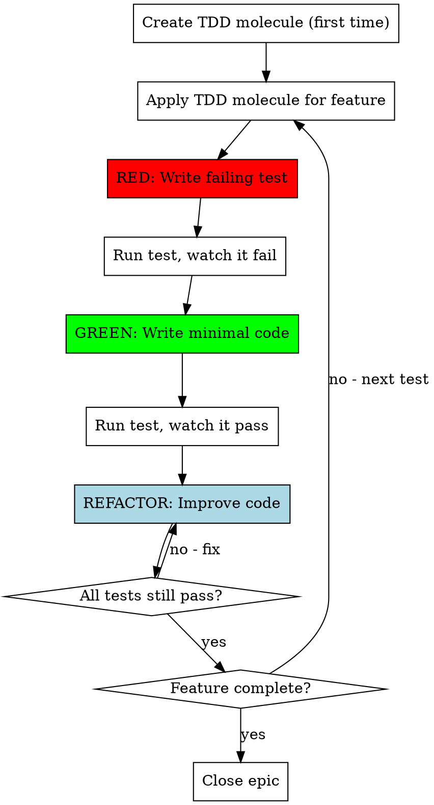

# Test-Driven Development with BD Integration

## Overview

**Test-Driven Development (TDD) is writing tests before code.** You write a failing test, write minimal code to pass it, then refactor.

**Core principle:** Red-Green-Refactor cycle, tracked with bd for persistence and visibility.

## The TDD Cycle with BD



## Creating the TDD Molecule (One-Time Setup)

```bash
# Create reusable TDD cycle molecule
bd molecule create tdd-cycle << 'EOF'
tasks:
  - name: "RED: Write failing test for {{feature}}"
    type: task
    priority: 1
    estimate: 15
    labels: ["tdd", "red-phase", "testing"]
    description: "Write test that describes desired behavior"
  
  - name: "RED: Watch test fail"
    type: task
    priority: 1
    estimate: 5
    labels: ["tdd", "red-phase", "verification"]
    deps: ["blocks:0"]
    description: "Run test, verify it fails for the right reason"
  
  - name: "GREEN: Write minimal code to pass"
    type: task
    priority: 1
    estimate: 20
    labels: ["tdd", "green-phase", "implementation"]
    deps: ["blocks:1"]
    description: "Write ONLY enough code to make test pass"
  
  - name: "GREEN: Watch test pass"
    type: task
    priority: 1
    estimate: 5
    labels: ["tdd", "green-phase", "verification"]
    deps: ["blocks:2"]
    description: "Run test, verify it passes"
  
  - name: "REFACTOR: Improve code with tests passing"
    type: task
    priority: 2
    estimate: 15
    labels: ["tdd", "refactor-phase", "quality"]
    deps: ["blocks:3"]
    description: "Clean up code while keeping tests green"
EOF

echo "TDD molecule created. Use: bd molecule apply tdd-cycle --vars feature=<name>"
```

## Using TDD for a Feature

### Step 1: Search and Create Epic
```bash
# Search for similar implementations
bd search "user authentication login"

# Create epic for the feature
bd create "Feature: User Authentication" --type epic --estimate 180
EPIC_ID=<id>
bd pin $EPIC_ID
```

### Step 2: Apply TDD Molecule for Each Test Case
```bash
# For each test case in the feature:
bd molecule apply tdd-cycle \
  --parent $EPIC_ID \
  --vars feature="login with valid credentials"

bd molecule apply tdd-cycle \
  --parent $EPIC_ID \
  --vars feature="reject invalid password"

bd molecule apply tdd-cycle \
  --parent $EPIC_ID \
  --vars feature="handle rate limiting"
```

### Step 3: Execute TDD Cycles
```bash
# Check what's ready
bd ready

# Work through RED phase
bd update <red-task-id> --status in_progress
# Write test...
bd audit "Test: Expects successful login with valid email/password"
bd close <red-task-id>

# Verify test fails
bd update <verify-fail-id> --status in_progress
# Run test, confirm failure
bd audit "Test fails as expected: 'login function not defined'"
bd close <verify-fail-id>

# GREEN phase
bd update <green-task-id> --status in_progress
# Write minimal code...
bd audit "Implemented basic login function, no validation yet"
bd close <green-task-id>

# Continue through cycle...
```

### Step 4: Track Progress
```bash
# See TDD progress
bd list --parent $EPIC_ID --label tdd
bd show $EPIC_ID  # Shows completion %, time spent

# Filter by phase
bd list --label red-phase
bd list --label green-phase
bd list --label refactor-phase
```

### Step 5: Complete Feature
```bash
# When all test cases done
bd unpin $EPIC_ID
bd close $EPIC_ID

# Review time spent
bd list --parent $EPIC_ID --status closed | grep estimate
# Compare estimates vs actual for retrospective
```

## TDD Rules (Enforced by BD)

### The Three Laws
1. **Write test first**: Red tasks MUST complete before green tasks (enforced by deps)
2. **Watch it fail**: Verification task blocks implementation
3. **Minimal code**: Green phase has strict scope

### What Counts as a Test?
```bash
# Create specific test task
bd create "Test: User can login with email" \
  --labels "unit-test,auth" --estimate 15

# NOT a test (too vague)
bd create "Test authentication" # ❌ Too broad
```

## Common TDD Patterns with BD

### Testing Error Cases
```bash
bd molecule create tdd-error-handling << 'EOF'
tasks:
  - name: "Test: {{error_case}} throws appropriate error"
    type: task
    labels: ["tdd", "error-handling", "red-phase"]
    estimate: 10
  - name: "Implement error handling for {{error_case}}"
    type: task
    labels: ["tdd", "error-handling", "green-phase"]
    estimate: 15
    deps: ["blocks:0"]
EOF

bd molecule apply tdd-error-handling --vars error_case="null input"
bd molecule apply tdd-error-handling --vars error_case="timeout"
```

### Testing Edge Cases
```bash
# Track edge cases systematically
bd create "Epic: Edge Cases" --type epic
bd create "Test: Empty array input" --parent $EPIC --labels "edge-case,tdd"
bd create "Test: Maximum size input" --parent $EPIC --labels "edge-case,tdd"
bd create "Test: Special characters" --parent $EPIC --labels "edge-case,tdd"
```

### Refactoring Under Tests
```bash
# When refactoring, create explicit task
bd create "Refactor: Extract validation logic" \
  --labels "refactor,tdd" \
  --estimate 30 \
  --description "All tests must stay green"

# Audit the refactoring
bd audit "Refactor: Extracted validation to separate module, 12/12 tests passing"
```

## Integration with Other Skills

### With subagent-driven-development
Subagents receive TDD tasks from bd:
```bash
# Controller creates TDD tasks
bd molecule apply tdd-cycle --vars feature="payment processing"

# Subagent works on tasks
bd ready  # Shows next TDD task
```

### With systematic-debugging
When debugging, create tests for bugs:
```bash
# Bug found
bd create "Bug: Login fails with special characters" --labels "bug,production"

# Create TDD tasks for fix
bd molecule apply tdd-cycle --vars feature="handle special chars in login"
```

## Benefits of BD-Enhanced TDD

**Persistence:**
- TDD cycles survive session interrupts
- Can resume exact phase (red/green/refactor)

**Visibility:**
- Clear phase tracking with labels
- Time tracking per phase for metrics
- Epic shows overall TDD progress

**Enforcement:**
- Dependencies prevent skipping test-first
- Can't accidentally do green before red
- Refactor phase explicitly tracked

**Reusability:**
- Molecules eliminate repetitive task creation
- Consistent TDD structure across features

**Metrics:**
```bash
# Analyze TDD efficiency
bd list --label red-phase --status closed | grep estimate
bd list --label green-phase --status closed | grep estimate
bd list --label refactor-phase --status closed | grep estimate
# Compare time spent in each phase
```

## Red Flags

**Never:**
- Write code without failing test first (deps prevent this)
- Skip the "watch it fail" step
- Write more code than needed to pass
- Refactor without tests passing
- Mark test task complete without actual test code
- Create vague test descriptions

**Always:**
- Search for similar tests first
- Use molecules for consistency
- Add time estimates to track efficiency
- Audit key decisions and test descriptions
- Close tasks immediately when complete

## The Bottom Line

TDD with bd makes the discipline trackable, measurable, and resumable. The molecule pattern ensures you never skip steps, dependencies enforce the cycle, and labels let you analyze your TDD practice over time.