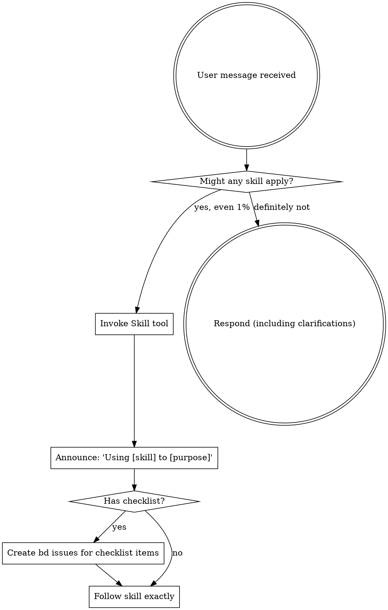

<EXTREMELY-IMPORTANT>
If you think there is even a 1% chance a skill might apply to what you are doing, you ABSOLUTELY MUST read the skill.

IF A SKILL APPLIES TO YOUR TASK, YOU DO NOT HAVE A CHOICE. YOU MUST USE IT.

This is not negotiable. This is not optional. You cannot rationalize your way out of this.
</EXTREMELY-IMPORTANT>

# Using Skills

## The Rule

**Check for skills BEFORE ANY RESPONSE.** This includes clarifying questions. Even 1% chance means invoke the Skill tool first.



## Red Flags

These thoughts mean STOP—you're rationalizing:

| Thought | Reality |
|---------|---------|
| "This is just a simple question" | Questions are tasks. Check for skills. |
| "I need more context first" | Skill check comes BEFORE clarifying questions. |
| "Let me explore the codebase first" | Skills tell you HOW to explore. Check first. |
| "I can check git/files quickly" | Files lack conversation context. Check for skills. |
| "Let me gather information first" | Skills tell you HOW to gather information. |
| "This doesn't need a formal skill" | If a skill exists, use it. |
| "I remember this skill" | Skills evolve. Read current version. |
| "This doesn't count as a task" | Action = task. Check for skills. |
| "The skill is overkill" | Simple things become complex. Use it. |
| "I'll just do this one thing first" | Check BEFORE doing anything. |
| "This feels productive" | Undisciplined action wastes time. Skills prevent this. |

## Skill Priority

When multiple skills could apply, use this order:

1. **Process skills first** (brainstorming, debugging) - these determine HOW to approach the task
2. **Implementation skills second** (frontend-design, mcp-builder) - these guide execution

"Let's build X" → brainstorming first, then implementation skills.
"Fix this bug" → debugging first, then domain-specific skills.

## Skill Types

**Rigid** (TDD, debugging): Follow exactly. Don't adapt away discipline.

**Flexible** (patterns): Adapt principles to context.

The skill itself tells you which.

## BD Integration for Checklists

When a skill contains a checklist, create bd issues to track completion:

```bash
# Example: Writing a skill with checklist
bd create "RED Phase: Create pressure scenarios" --type task --priority 1
bd create "RED Phase: Run baseline tests" --type task --priority 1 --deps blocks:<previous-id>
bd create "GREEN Phase: Write minimal skill" --type task --priority 1 --deps blocks:<previous-id>
bd create "REFACTOR Phase: Close loopholes" --type task --priority 1 --deps blocks:<previous-id>
bd create "Quality: Add CSO keywords" --type task --priority 2
bd create "Deploy: Commit and push" --type task --priority 2 --deps blocks:<all-previous>

# Track progress
bd list --status open
bd update <id> --status in_progress
bd close <id>
```

Benefits of bd for checklists:
- **Persistence**: Checklist survives session interruptions
- **Dependencies**: Enforce proper ordering
- **Visibility**: See what's been done and what remains
- **Notes**: Add context with `bd comment`

## User Instructions

Instructions say WHAT, not HOW. "Add X" or "Fix Y" doesn't mean skip workflows.